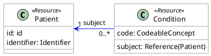

# Visualizing Interoperability: Architectural Graphics in the FHIR IG Publisher

As a medical software architect, I’ve often found that the hardest part of building interoperable systems isn't the data itself—it's communicating the *intent* of that data. We spend months refining FHIR profiles and Extension Definitions, but when it comes time for a developer or a clinician to actually *use* our Implementation Guide (IG), they are often met with walls of tables and XML snippets.

Visualizations are the bridge between abstract data models and real-world clinical workflows. Over the last few years, the FHIR IG Publisher has evolved from a simple static site generator into a sophisticated toolchain for architectural visualization.

Today, we have three primary ways to bring our IGs to life: **Mermaid**, **PlantUML**, and the newly introduced **Automated Class Diagrams**. Let’s explore when and why to use each.

---

## 1. Mermaid: The Agile Communicator

Mermaid is the "markdown for diagrams." It’s a JavaScript-based tool that renders diagrams at runtime directly from text. Its greatest strength is its simplicity and the fact that it doesn't require any external build tools or pre-processing.

In the IG Publisher, you can include Mermaid diagrams directly in your narrative pages.

### Example: A Simple Patient Workflow

```html
<div class="mermaid">
graph TD;
    A[Patient Check-in] --> B{Existing Record?};
    B -- Yes --> C[Update Info];
    B -- No --> D[Create New Patient];
    C --> E[Proceed to Clinical Encounter];
    D --> E;
</div>
```

### Why use it?
- **Speed**: Perfect for quick flowcharts, sequence diagrams, and state machines.
- **Maintainability**: The source code is right there in your markdown file.
- **No Dependencies**: It works "out of the box" with modern IG templates.


---

## 2. PlantUML: The Architectural Heavyweight

For more complex architectural needs, PlantUML has long been the gold standard. Unlike Mermaid, PlantUML diagrams are pre-rendered into SVG or PNG files during the IG build process. This makes them ideal for large, stable diagrams that require precise control over layout and styling.

### Example: Resource Relationship Diagram

In your `input/images-source/` directory, you might have a file named `resource-links.plantuml`:



### Why use it?
- **Robustness**: Handles massive diagrams better than Mermaid.
- **Pre-rendering**: No runtime performance hit; the diagram is just a static image for the user.
- **Customization**: Extensive skinning and styling options to match your IG's aesthetic.


---

## 3. The New Kid: Automated Class Diagrams

Perhaps the most exciting recent addition to the architect's toolkit is the ability to generate **UML Class Diagrams directly from StructureDefinitions**. 

Historically, we had to manually keep our diagrams in sync with our profiles—a process that was error-prone and tedious. Now, the IG Publisher can automatically extract the structure of your profiles and generate a "base" UML SVG.

### How it works:
1. **Enable Generation**: Add `generate-uml: source` to your IG parameters.
2. **The "Merge" Workflow**: The Publisher creates a raw SVG with all your profile elements. 
3. **Manual Layout (Inkscape)**: Instead of fighting with layout code, you open the generated SVG in [Inkscape](https://inkscape.org/). You arrange the boxes, route the lines, and save it in `input/diagrams/`. 
4. **Synchronization**: The magic happens during the next build. The Publisher "merges" your profiles' updated metadata *into* the layout you created in Inkscape.

### Why use it?
- **Automatic Accuracy**: Your diagrams are never out of sync with your resource definitions.
- **Design Control**: You get the best of both worlds—automated data extraction and manual design layout.
- **Logical Models**: It is particularly powerful for complex logical models where the relationship between elements is the primary focus.


---

## Choosing the Right Tool

As architects, we must match the tool to the objective:

- Use **Mermaid** for workflow narratives and simple state transitions within your documentation.
- Use **PlantUML** for cross-resource dependencies and system-level architectural overviews.
- Use the **Automated Class Diagrams** for profile-specific deep dives where the structure of the data itself is the story.

The ability to visualize clinical data structures is no longer a luxury; it’s a requirement for building the next generation of interoperable healthcare systems. With these three tools in your belt, you can ensure that your Implementation Guide is not just a specification, but a roadmap.

---
*For more detailed guidance on setting up these features, check out the official [HL7 UML Guidance](https://build.fhir.org/ig/FHIR/ig-guidance/uml.html).*
